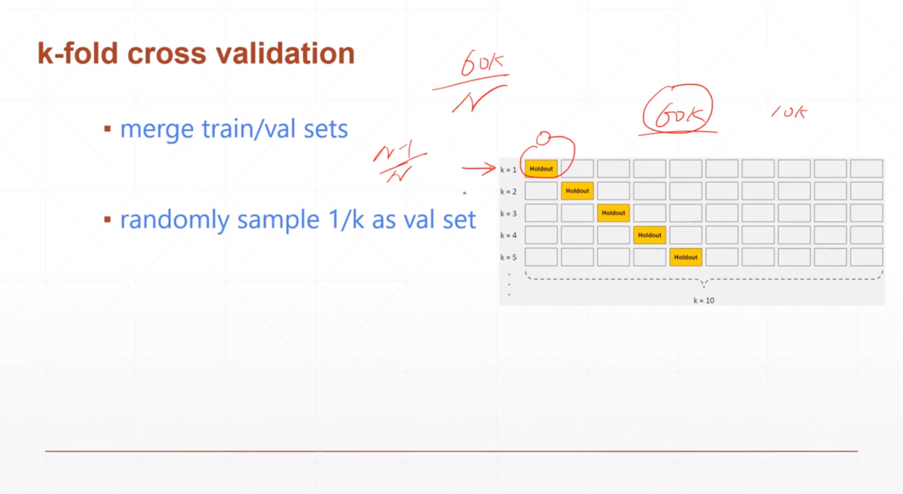

### Tensor
rand 0~1随机分布
randint (min, max, shape) [min, max)随机分布
randn 0~1正态分布
torch.normal(mean, std): 生成根据mean和std生成正态分布
torch.full(shape, value)
torch.arange(min, max, stride): 按照递增顺序生成序列(min. max)
torch.linespace(min, max, steps): 按照steps等分[min, max]
torch.ones
torch.zeros
torch.eye()：只能接受一维或二维参数，因为只能用于二维矩阵
torch,randperm(10)：生成不包括10的随机序列，用于shuffle，生成随机种子，类似numpy_seed
torch.all
torch.eq

### 索引与切片

1. : [0, n]
2. :n [0, n]
3. n: [n, -1]
4. : : 3

a.index_select(dim, torch.tensor[shape])
a[0， ..., ::2]:  ...表示剩下的维度都取

mask = x.ge(0.5): 选取大于等于0.5的元素 
torch.masked_select(a, mask)
torch.take(src, torch.tensor([shape]):

### 维度变换
view/reshape
Squeeze/unsqueeze

Expand/repeat：
Expand：broadcasting 参数是目标维度
Repeat：memory copied 参数是倍数

Transpose：两个维度交换
contiguous：
permute: 任意多个维度交换

### Broadcast
expand
expand_as(A)
小维度往大维度扩张

### 合并与切割

### 基本运算

### 统计属性

### 高阶OP

### 常见激活函数及其梯度

### Loss及其梯度

### 单一输出感知机

### 多输出感知机

### 交叉熵

### 多分类实战

### PyTorch全连接层

### 激活函数与GPU加速

### 测试

### Visdom可视化

### 过拟合&欠拟合

### nn.Module

